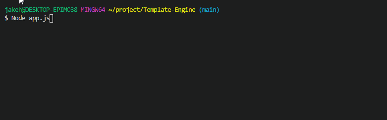
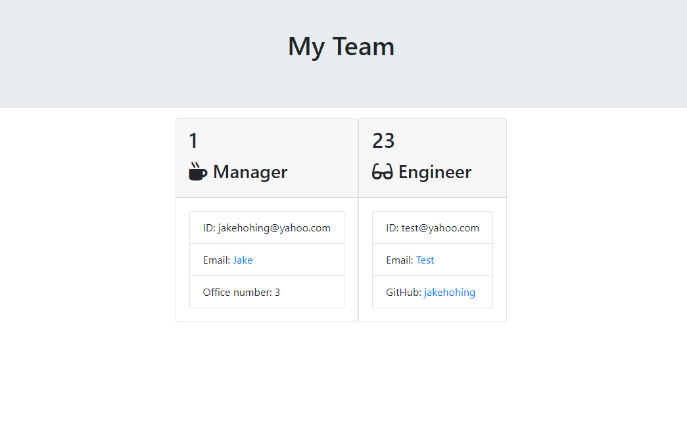

# Template-Engine

This Project is designed to output an HTML displaying team members provided by the user.

- Once the app is initiated, you will be prompted to provide detailed information for a team member (name, role, uniqueID, email, and a role specific input).
- Once all members have been input, and the user selects the option not to continue adding members, a file will be generated.
- The file can be found in the 'output' folder, labeled team.html. It will display all the team memebrs and their detail data in a structured format. 

## Video Walkthrough of Prompts and File Generation

## The Generated HTML Page
